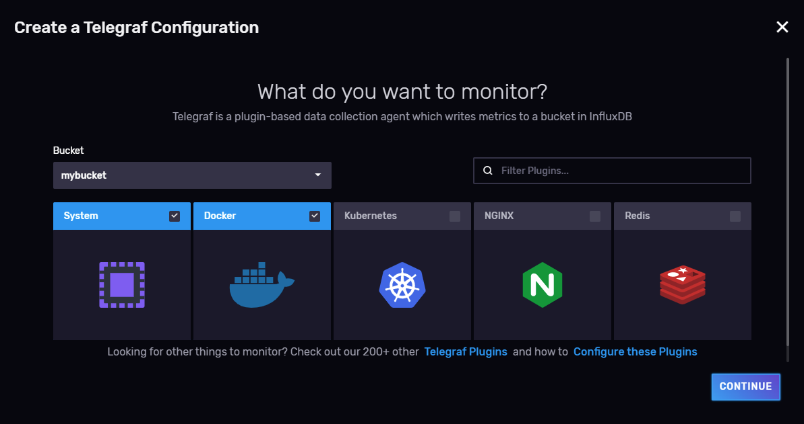
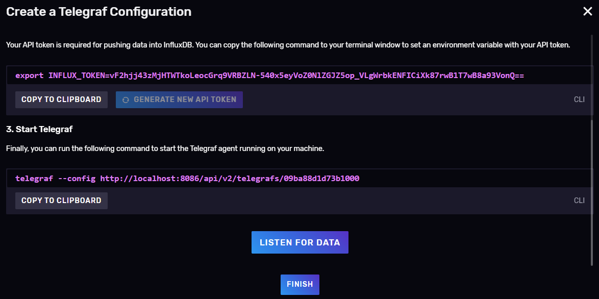
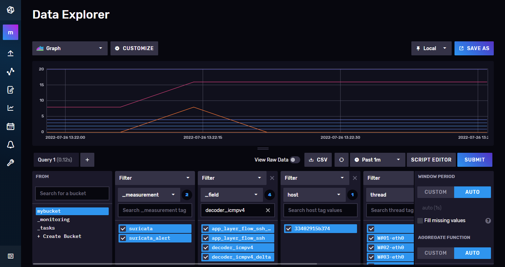

# Service with Suricata, Telegraf, InfluxDB and Grafana

- [Service with Suricata, Telegraf, InfluxDB and Grafana](#service-with-suricata-telegraf-influxdb-and-grafana)
  - [Versions](#versions)
  - [Pre-requisites](#pre-requisites)
  - [Getting Started](#getting-started)
    - [Configure suricata](#configure-suricata)
      - [Configure suricata.yaml](#configure-suricatayaml)
        - [Global stats configuration](#global-stats-configuration)
        - [Eve-log configuration](#eve-log-configuration)
    - [Configure telegraf](#configure-telegraf)
      - [configure telegraf.conf](#configure-telegrafconf)
        - [Global tags configuration](#global-tags-configuration)
        - [Input configuration](#input-configuration)
        - [Output configuration](#output-configuration)
    - [Permissions for Socket shared in volume](#permissions-for-socket-shared-in-volume)
    - [Configure InfluxDB](#configure-influxdb)
  - [How to Start](#how-to-start)
    - [Mapped Ports](#mapped-ports)
    - [Grafana](#grafana)
      - [Data source on Grafana](#data-source-on-grafana)
    - [InfluxDB](#influxdb)
      - [Web Interface](#web-interface)

## Versions

- Suricata:          6.0.6
- InfluxDB:          2.3.0
- Telegraf (StatsD): 1.23.2
- Postgres:          14.2.0
- Grafana:           8.4.3

## Pre-requisites

- Download and install the latest available version of [Docker](https://docs.docker.com/engine/install/ubuntu/)
- Download and install the latest available version of [Docker Compose](https://docs.docker.com/compose/install/)
- Configure [Docker as non root](https://docs.docker.com/engine/install/linux-postinstall/)

## Getting Started

### Configure suricata

*The following settings have already been made, so they should be followed in case new rules are added or updated.*

1. Download rules from the community:

    ```bash
    wget http://rules.emergingthreats.net/open/suricata/emerging.rules.tar.gz
    ```

2. Unzip the rules

    ```bash
    tar zxvf emerging.rules.tar.gz
    ```

3. Move `~/rules` folder to `~/composer-suri-tele-infl-graf/suricata/`

    ```bash
    sudo mv rules /var/lib/suricata/
    ```

4. Configure `docker-compose.yaml` file, adding next line as volume:

    ```bash
      - ./suricata/rules:/var/lib/suricata/rules
    ```

5. Create `my-rules` file:

    ```bash
      - vim ~/composer-suri-tele-infl-graf/suricata/rules/my-rules
    ```

6. Add next rules:

    1. Ping detection

        ```bash
          alert icmp any any -> $HOME_NET any (msg:"ICMP connection attempt"; sid:1000002; rev:1;)
        ```

    2. SSH connections detection

        ```bash
          alert tcp any any -> $HOME_NET 22 (msg:"SSH connection attempt"; sid:1000003; rev:1;)
        ```

    3. Detects excessive packet forwarding to port 80.

        ```bash
          alert tcp any any -> $HOME_NET 80 (msg:"DDoS Unusually fast port 80 SYN packets outbound, Potential DDoS"; flags: S,12; threshold: type both, track by_dst, count 500, seconds 5; classtype:misc-activity; sid:6;)
        ```

7. Edit suricata configuration file:

    ```bash
    sudo vim ~/composer-suri-tele-infl-graf/suricata/suricata.yaml
    ```

8. Modify `default-rule-path` adding `path`, `community rules` and `personal rules`:

    ```bash
    default-rule-path: /var/lib/suricata/rules

    rule-files:
  
        - emerging-exploit.rules
  
        - my-rules
    ```

#### Configure suricata.yaml

##### Global stats configuration

```bash
# Global stats configuration
stats:
  enabled: yes
  # The interval field (in seconds) controls the interval at
  # which stats are updated in the log.
  interval: 8
  # Add decode events to stats.
  decoder-events: true
  # Decoder event prefix in stats. Has been 'decoder' before, but that leads
  # to missing events in the eve.stats records. See issue #2225.
  decoder-events-prefix: "decoder.event"
  # Add stream events as stats.
  stream-events: false
```

##### Eve-log configuration

```bash
- eve-log:
    enabled: yes
    filetype: unix_stream
    filename: /var/run/suricata/suricata-command.socket
    types:
      - stats:
          totals: yes       # stats for all threads merged together
          threads: yes       # per thread stats
          deltas: yes        # include delta values
      - alert:
         enabled: yes
         payload: yes
         metadata: yes
```

### Configure telegraf

#### configure telegraf.conf

##### Global tags configuration

```bash
# Global tags can be specified here in key="value" format.
[global_tags]
  # dc = "us-east-1" # will tag all metrics with dc=us-east-1
  # rack = "1a"
  ## Environment variables can be used as tags, and throughout the config file
  # user = "$USER"
```

##### Input configuration

```bash
# Suricata stats and alerts plugin
[[inputs.suricata]]
  ## Data sink for Suricata stats and alerts logs
  # This is expected to be a filename of a
  # unix socket to be created for listening.
  source = "/var/run/suricata-command.socket"

  # Delimiter for flattening field keys, e.g. subitem "alert" of "detect"
  # becomes "detect_alert" when delimiter is "_".
  delimiter = "_"

  ## Detect alert logs
  alerts = true
```

##### Output configuration

```bash
# # Configuration for sending metrics to InfluxDB
[[outputs.influxdb_v2]]
  ## The URLs of the InfluxDB cluster nodes.
  ##
  ## Multiple URLs can be specified for a single cluster, only ONE of the
  ## urls will be written to each interval.
  ##   ex: urls = ["https://us-west-2-1.aws.cloud2.influxdata.com"]
  urls = ["http://influxdb:8086"]

  ## Token for authentication.
  token = "$INFLUXDB_INIT_ADMIN_TOKEN"

  ## Organization is the name of the organization you wish to write to; must exist.
  organization = "$INFLUXDB_INIT_ORG"

  ## Destination bucket to write into.
  bucket = "$INFLUXDB_INIT_BUCKET"
```

Environmental variables must be updated on: ~/composer-suri-tele-infl-graf

```bash
INFLUXDB_INIT_ORG=myorganization
INFLUXDB_INIT_BUCKET=mybucket
INFLUXDB_INIT_ADMIN_TOKEN=vF2hjj43zMjHTWTkoLeocGrq9VRBZLN-540x5eyVoZ0NlZGJZ5op_VLgWrbkENFICiXk87rwB1T7wB8a93VonQ==
```

### Permissions for Socket shared in volume

1. Give permissions to the shared volume for sockets

    ```bash
    sudo chmod 600 -R /var/run/shared/*
    ```

2. Add aditional volume in suricata docker-compose service:

    ```bash
      - /var/run/shared:/var/run/suricata/
    ```

3. Add aditional volume in telegraf docker-compose service:

    ```bash
      - /var/run/shared:/var/run/
    ```

### Configure InfluxDB

1. Verify the bucket creation

   

2. Associate telegraf agent to this bucket

   

3. Configure plugins

   

4. Collect token and press *Listen for Data* Button

   

5. Selects metrics and configure dashboard

   

## How to Start

In order to start the service the first time launch:

```bash
COMPOSE_PROFILES=grafana,telegraf docker compose up -d
```

You can replace `COMPOSE_PROFILES=grafana,telegraf` with the desired profiles to launch, you can launch only InfluxDB (default with no profiles).

To stop the service launch:

```bash
COMPOSE_PROFILES=grafana,telegraf docker compose down
```

### Mapped Ports

```
Host		Container		Service

3000		3000			grafana
8086		8086		  	influxdb
8125		8125			statsd
```

### Grafana

Open <http://localhost:3000>

```bash
Username: admin
Password: admin
```

#### Data source on Grafana

InfluxDB data source is automatically provisioned with new Flux language support flag.

### InfluxDB

#### Web Interface

Open <http://localhost:8086>

```bash
Username: admin
Password: admin123456
Port: 8086
```
